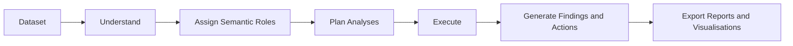

# EazyDataFix

[](https://pypi.org/project/eazydatafix/)
[](https://pypi.org/project/eazydatafix/)
[](LICENSE)
[](https://pypi.org/project/eazydatafix/)
[](https://github.com/suneelprojects/eazydatafix/releases)
[](https://github.com/suneelprojects/eazydatafix)

## Deterministic data transformation you can inspect and trust

EazyDataFix is a deterministic-first Python library for turning messy datasets
into reliable, typed, auditable data for analysis and downstream tools.

It combines dataset profiling, quality assessment, controlled cleaning, safe
type conversion, preparation, contracts, and before-and-after reporting. The
active roadmap is focused on Analysis Ready, ML Ready, and Power BI Ready data
profiles. Existing EDA and Agentic EDA APIs remain available for compatibility,
but are not the current development focus.

> EazyDataFix v1.4.1 is the current stable production release. It preserves
> the v1 API and adds deterministic Analysis Ready, leakage-safe ML Ready, and
> validated Power BI Ready workflows.

Install with `pip install eazydatafix` ·
[Documentation](https://eazydatafix.com/docs) ·
[PyPI](https://pypi.org/project/eazydatafix/)

## Quick start

Preview a controlled transformation without modifying the source dataset:

```python
import eazydatafix as edf

preview = edf.fix(
    "employees.csv",
    edf.FixConfig(
        dry_run=True,
        numeric_conversion_threshold=0.95,
        date_parsing_threshold=0.80,
    ),
)

print(preview.proposed_dataset)
print(preview.change_log)
```

Apply the same rules and continue with the prepared DataFrame:

```python
result = edf.fix(
    "employees.csv",
    edf.FixConfig(
        numeric_conversion_threshold=0.95,
        date_parsing_threshold=0.80,
    ),
)
preparation = edf.prepare_with_report(result.dataset)

df = preparation.dataset
print(preparation.changes)
print(df.dtypes)
```

Or use the existing analysis-ready convenience workflow:

```python
df = edf.analysis_ready("employees.csv")
```

Return the same prepared dataset with readiness evidence:

```python
result = edf.analysis_ready_with_report(
    "employees.csv",
    edf.AnalysisReadyConfig(
        prepare_config=edf.PrepareConfig(
            outlier_action="flag",
            derive_date_parts=("year", "month", "day_of_week"),
        ),
    ),
)

print(result.before_score, result.after_score, result.is_ready)
print(result.changes)
print(result.warnings)
print(result.validations)

df = result.dataset
```

The detailed workflow composes assessment, controlled fixing, preparation,
and final validation. It also reports constant, nearly empty, invalid, and
inconsistently labelled category columns without hiding them from the user.

Prepare leakage-safe supervised machine-learning inputs:

```python
result = edf.ml_ready(
    "customer_churn.csv",
    target="churned",
    config=edf.MLReadyConfig(
        test_size=0.20,
        categorical_encoding="one_hot",
        scaling="standard",
    ),
)

X_train, X_test = result.X_train, result.X_test
y_train, y_test = result.y_train, result.y_test

print(result.readiness_score, result.is_ready)
print(result.feature_names)
print(result.issues)

# Reuse parameters fitted only from X_train.
result.artifact.to_json("churn_preprocessing.json")
```

`ml_ready(...)` requires an explicit target, splits rows before fitting learned
transformations, and never trains or evaluates a model. Identifiers, constants,
high-cardinality features, unsupported datetimes, and likely leakage fields are
reported and safely excluded by default. Missing target rows are dropped before
splitting; the target itself is never imputed, encoded, or scaled.

Prepare a validated multi-table Power BI model input:

```python
tables = {
    "sales": "sales.csv",
    "customers": "customers.csv",
}

result = edf.powerbi_ready(
    tables,
    edf.PowerBIReadyConfig(
        keys=(edf.PowerBIKey("customers", ("customer_id",)),),
        relationships=(
            edf.PowerBIRelationship(
                "sales",
                ("customer_id",),
                "customers",
                ("customer_id",),
                "many_to_one",
            ),
        ),
        generate_date_table=True,
        date_columns={"sales": ("order_date",)},
    ),
)

print(result.readiness_score, result.is_ready)
print(result.field_types)
print(result.issues)

result.save("powerbi_output", formats=("csv", "excel"))
```

`powerbi_ready(...)` also accepts a single DataFrame or file. It composes the
Analysis Ready workflow, normalizes collision-free names and supported field
types, flattens record-valued fields, validates keys and relationship
cardinality, and can generate a continuous date dimension. Exports include a
JSON readiness report; Parquet uses the existing `parquet` extra. EazyDataFix
prepares model inputs but intentionally does not generate `.pbix` reports,
visuals, measures, or dashboards.

The controlled transformation pipeline can:

1. Normalize column names and text whitespace
2. Detect configured missing-value markers
3. Convert safe numeric, currency, percentage, boolean, and date values
4. Preserve identifiers, phone numbers, emails, and leading zeroes
5. Remove configured duplicates and empty structures
6. Record every applied or proposed change

## Installation

```bash
pip install eazydatafix
```

For Parquet support:

```bash
pip install "eazydatafix[parquet]"
```

For optional scikit-learn transformer interoperability:

```bash
pip install "eazydatafix[ml]"
```

Requires Python 3.10 or later. Tested with Python 3.10–3.13.

## Why EazyDataFix

### Deterministic First

Metrics, findings, and recommendations come from reproducible calculations.

### Traceable Decisions

Plans, actions, questions, and visualisations identify their source analysis
step.

### Safe by Default

Caller DataFrames are not mutated by the deterministic EDA workflow.

### AI Optional

The deterministic workflow does not require an LLM. The v0.5.0 release adds
optional grounded narratives through a provider adapter; existing workflows
continue to run without an API key or AI dependency.

## Optional grounded AI narrative

Create a business-facing narrative only after deterministic analysis is complete.
The provider receives an immutable, compact evidence brief, not the raw dataset.
Every generated statement must cite one or more evidence IDs from that brief.
EazyDataFix rejects malformed or unknown citations, invented numbers,
unsupported causal language, and claims without sufficient lexical support in
their cited evidence. The narrative is bound to the exact workflow by a SHA-256
fingerprint, so it cannot be exported with a different or modified workflow.

These deterministic checks reduce unsupported output but cannot prove the
semantic truth of AI-written text. Review the narrative before using it for a
decision. HTML and Markdown reports include an evidence-reference section for
that review.

```python
import eazydatafix as edf
from eazydatafix.narratives import OpenAINarrativeProvider

workflow = edf.run_agentic_eda("employees.csv")
provider = OpenAINarrativeProvider(model="your-openai-model")

narrative = edf.generate_agentic_eda_narrative(workflow, provider)

report = edf.export_agentic_eda_report(
    workflow,
    output_dir="eda-report",
    formats=["html", "json", "markdown"],
    narrative=narrative,
)
```

Install the adapter only when needed:

```bash
pip install "eazydatafix[openai]"
```

## Workflow



## Current capabilities

### Data Quality

- Missing-value analysis
- Duplicate detection
- Completeness checks
- Validity checks
- Consistency checks
- Accuracy checks
- Timeliness checks
- Data-quality scoring

### Deterministic EDA

- Numeric analysis
- Categorical analysis
- Boolean analysis
- Datetime analysis
- Correlation review
- IQR outlier analysis
- Skewness analysis
- Class-imbalance analysis

### Agentic Workflow

- Semantic column-role detection
- Deterministic analysis planning
- Modular analysis execution
- Priority findings
- Traceable follow-up actions
- Visualisation recommendations
- Unresolved domain questions
- Partial-failure isolation
- Human approval checkpoints between planning and execution
- Dataset fingerprint validation before approved execution

### Reporting

- Console
- HTML
- PDF
- Excel
- CSV
- JSON
- Markdown
- Deterministic PNG visualisations
- Ready-to-run Jupyter Notebook export

### Input Support

- pandas DataFrames
- CSV
- Excel
- JSON
- Parquet with the optional dependency

## Example output

A data-quality assessment can produce a concise console summary:

```text
EASYDATAFIX DATA QUALITY REPORT

Score         : 90.37 / 100
Grade         : A
Completeness  : 96.97%
Uniqueness    : 100.00%
Validity      : 55.00%
Consistency   : 100.00%
Accuracy      : 100.00%
Timeliness    : 100.00%
```

An Agentic EDA report with HTML, JSON, and optional Markdown output can produce:

```text
eda-report/
├── agentic-eda-report.html
├── agentic-eda-report.json
├── agentic-eda-report.md
└── visualisations/
    ├── 01-missing-value-chart-phone-salary.png
    ├── 02-bar-chart-department.png
    └── 03-time-series-line-chart-joining-date.png
```

HTML and JSON are generated by default; Markdown is generated when requested.
The exact charts depend on the dataset and the workflow's deterministic
visualisation recommendations.

## API overview

| Public API | Purpose |
| --- | --- |
| `edf.profile(...)` | Describe dataset structure, columns, types, and memory use. |
| `edf.assess(...)` | Measure data quality and return validations and recommendations. |
| `edf.assess_ai_readiness(...)` | Evaluate suitability for AI-oriented data use. |
| `edf.eda(...)` | Generate deterministic exploratory statistics and semantic roles. |
| `edf.plan_eda(...)` | Select and explain relevant follow-up analyses. |
| `edf.execute_eda(...)` | Execute selected deterministic analysis steps. |
| `edf.run_agentic_eda(...)` | Run understanding, planning, execution, and follow-up decisions. |
| `edf.prepare_agentic_eda_approval(...)` | Prepare understanding and planning without executing analysis steps. |
| `edf.approve_agentic_eda_plan(...)` | Approve all or selected originally planned steps. |
| `edf.reject_agentic_eda_plan(...)` | Explicitly reject a pending analysis plan. |
| `edf.resume_agentic_eda(...)` | Resume an approved plan after dataset fingerprint validation. |
| `edf.export_agentic_eda_report(...)` | Export Agentic EDA reports and recommended visualisations. |
| `edf.export_agentic_eda_notebook(...)` | Export a reproducible, ready-to-run Jupyter Notebook. |
| `edf.generate_agentic_eda_narrative(...)` | Generate a cited optional AI narrative from deterministic workflow evidence. |
| `edf.fix(...)` | Apply controlled, configurable cleaning with optional dry-run audit records. |
| `edf.run(...)` | Run profile → assess → fix → EDA as one deterministic workflow. |
| `edf.prepare_with_report(...)` | Prepare data with deterministic change and readiness details. |
| `edf.infer_schema(...)` / `edf.validate_contract(...)` | Infer and enforce pipeline data contracts. |
| `edf.prepare(...)` | Prepare types and columns for downstream analysis. |
| `edf.analysis_ready(...)` | Clean and prepare a dataset in one workflow. |
| `edf.analysis_ready_with_report(...)` | Return Analysis Ready data with scores, changes, warnings, and validation. |
| `edf.ml_ready(...)` | Create leakage-safe train/test inputs and reusable preprocessing artifacts. |
| `edf.powerbi_ready(...)` | Prepare validated single-table or multi-table Power BI model inputs and exports. |

Detailed API documentation is maintained on the
[documentation website](https://eazydatafix.com/docs).

## Resources

- [Project Website](https://eazydatafix.com)
- [Getting Started](https://eazydatafix.com/docs/quickstart)
- [Documentation](https://eazydatafix.com/docs)
- [API Reference](https://eazydatafix.com/docs/reference)
- [Roadmap](ROADMAP.md)
- [Changelog](CHANGELOG.md)
- [PyPI](https://pypi.org/project/eazydatafix/)
- [GitHub Repository](https://github.com/suneelprojects/eazydatafix)
- [GitHub Issues](https://github.com/suneelprojects/eazydatafix/issues)

## Project status

- Current stable version: v1.4.1
- Development status: Production/Stable
- Released: 26 August 2026
- Python support: 3.10–3.13
- Licence: MIT

The v1 public API follows Semantic Versioning. Backward-incompatible public API
changes require a new major version.

## Roadmap preview

- **v0.3.0 — Deterministic Agentic EDA Foundation — Released**
- **v0.4.0 — Notebook Export and Human Approval — Released**
- **v0.5.0 — Optional Grounded AI Narratives — Released**
- **v0.6.0 — Controlled, Auditable Cleaning — Shipped in v1.0.0**
- **v0.7.0 — Data Preparation and Feature Readiness — Shipped in v1.0.0**
- **v0.8.0 — Data Validation and Contracts — Shipped in v1.0.0**
- **v0.9.0 — Production Workflow — Shipped in v1.0.0**
- **v1.0.0 — Stable Production API — Released**
- **v1.2.0 profile — Analysis Ready — Shipped in v1.4.0**
- **v1.3.0 profile — ML Ready — Shipped in v1.4.0**
- **v1.4.0 — Power BI Ready and transformation-first release — Shipped**
- **v1.4.1 — Reproducible packaging maintenance release — Current**

See the [full roadmap](ROADMAP.md) for milestone details.

## Contributing

Contributions, issue reports, and focused feature proposals are welcome.
See [CONTRIBUTING.md](CONTRIBUTING.md) for the development workflow, quality
checks, and pull-request guidance. Use
[GitHub Issues](https://github.com/suneelprojects/eazydatafix/issues) to report
bugs or discuss a focused change.

## Licence

EazyDataFix is available under the [MIT Licence](LICENSE).
